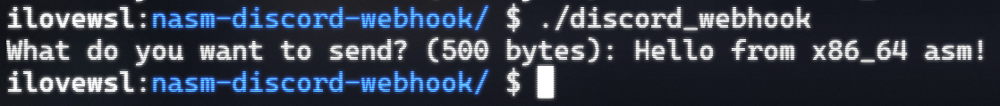

# x86_64 NASM Discord Webhook
Using assembly to send a message to a Discord webhook! \
Yes, I cheated. It uses curl to actually send the requests. \
I do not have the skill nor time to work out the TLS handshake along with other HTTPS shenanigans.

19kb executable (elf64 built on ubuntu wsl) \
It takes user input on what you want to send.

#### Build
**Make sure to set the webhook URL on line 27‼**
```sh
nasm -f elf64 discord_webhook.asm -o discord_webhook.o
ld discord_webhook.o -o discord_webhook
```

 \
